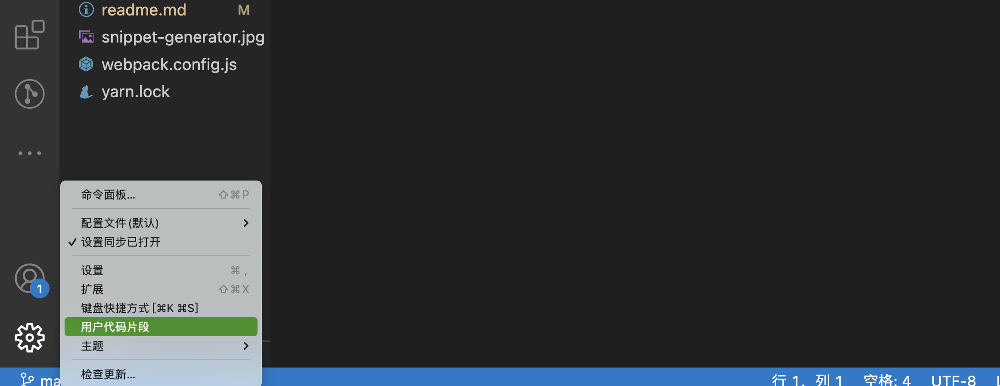
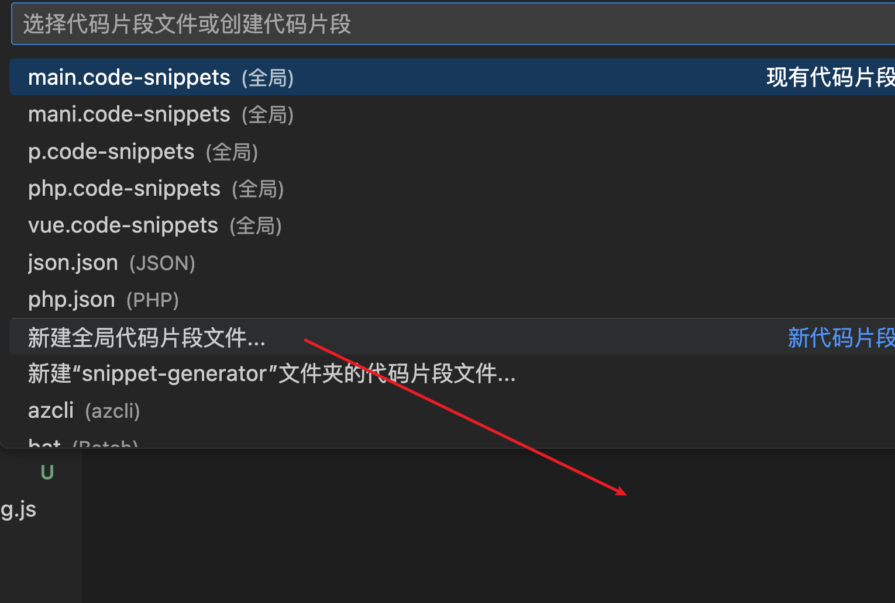
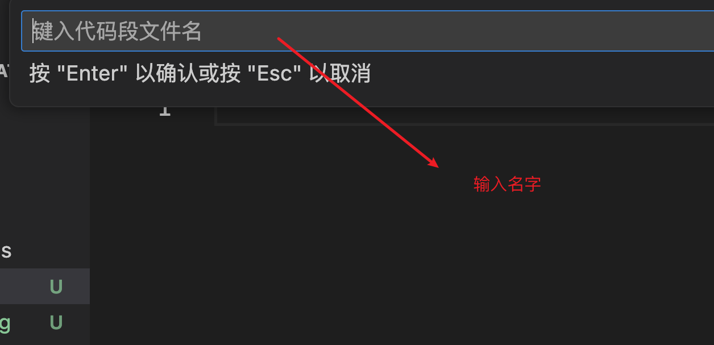
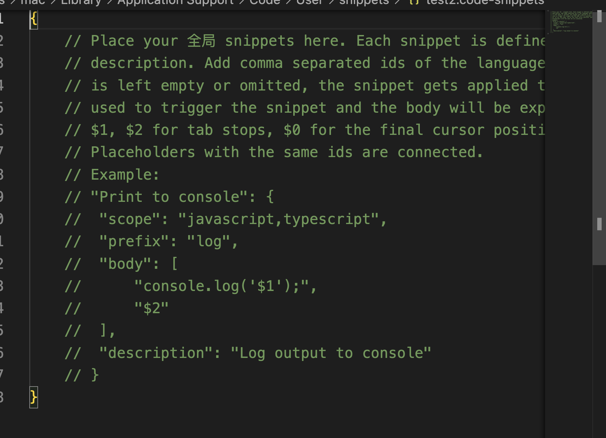
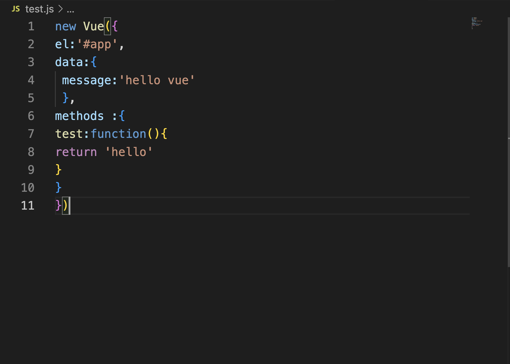
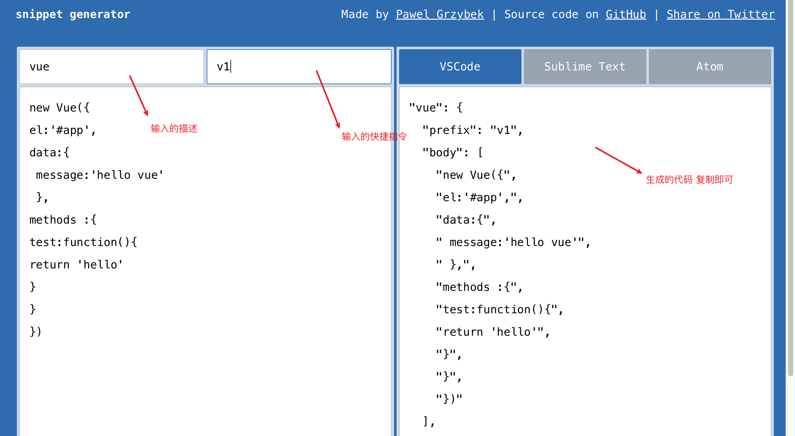
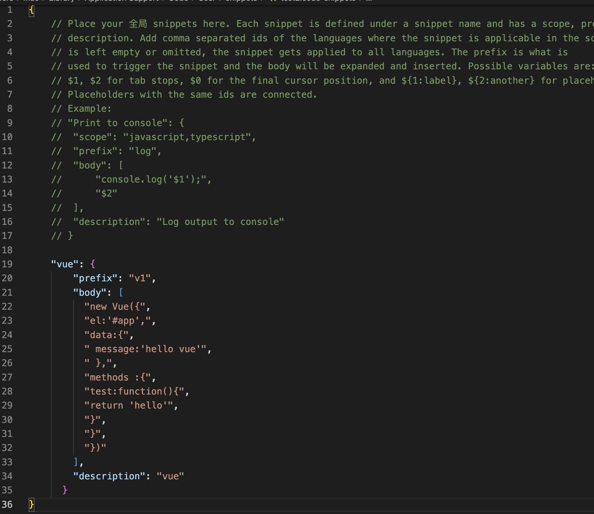
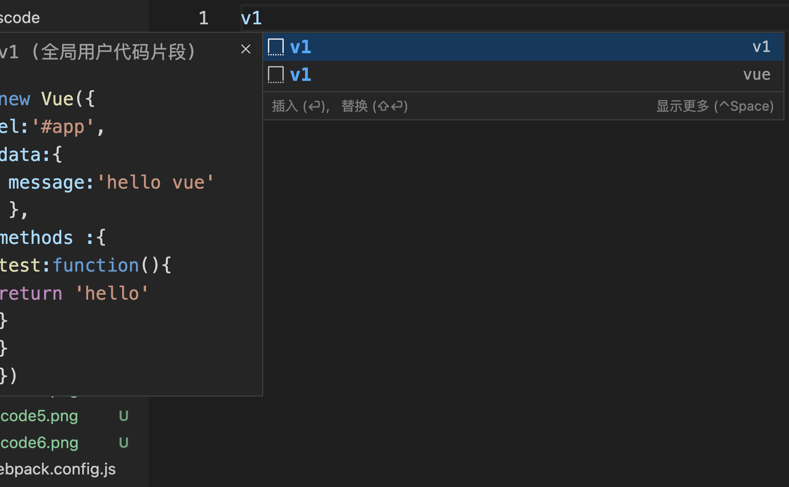

# snippet generator [vscode 生成代码段的代码] 

[Snippet generator](https://snippet-generator.app/) is a tiny React app to help you create [Visual Studio Code](https://code.visualstudio.com/), [Sublime Text](https://www.sublimetext.com/) and [Atom](https://atom.io/) snippets.
## clone project [克隆项目]
  first  clone the project
## install npm  [安装npm]
    打开网址      https://nodejs.org/zh-cn/download/。
    MacOs        brew install node
    国内镜像 
    windows:
    linux: 
## install yarn  [全局安装yarn]
sudo npm install --global yarn   
## build the project  

```js
cd  snippet-generator-master && yarn global add webpack
```


## 构建过程

```js
webpack-cli
安装完成后，webpack 命令应该已经在你的系统
yarn global v1.22.19
[1/4] 🔍  Resolving packages...
[2/4] 🚚  Fetching packages...
[3/4] 🔗  Linking dependencies...
[4/4] 🔨  Building fresh packages...
success Installed "webpack@5.78.0" with binaries:

   - webpack
     success Installed "webpack-cli@5.0.1" with binaries:
        - webpack-cli
          ✨  Done in 26.54s.


```


## start th porjcet
###  Enter command     输入命令

```js
yarn dev

```

### the interface after the command is executed. 命令运行后界面

```js
yarn run v1.22.19
$ webpack-dev-server --mode development --open
ℹ ｢wds｣: Project is running at http://localhost:8080/
ℹ ｢wds｣: webpack output is served from /
ℹ ｢wds｣: Content not from webpack is served from /Users/mac/Documents/snip
ℹ ｢wdm｣: wait until bundle finished: /
Browserslist: caniuse-lite is outdated. Please run:
  npx browserslist@latest --update-db
  Why you should do it regularly: https://github.com/browserslist/browserslist#browsers-data-updating
ℹ ｢wdm｣: Hash: 04bc664adadeb21257a1
Version: webpack 4.46.0
Time: 2025ms
Built at: 2023/04/11 12:01:27
                Asset       Size  Chunks                    Chunk Names
    favicon-16x16.png  554 bytes          [emitted]
    favicon-32x32.png   1.46 KiB          [emitted]
          favicon.ico    106 KiB          [emitted]
           index.html   1.94 KiB          [emitted]
              main.js   1.56 MiB    main  [emitted]  [big]  main
snippet-generator.jpg   23.3 KiB          [emitted]
Entrypoint main [big] = main.js
```


## 运行界面 website


Enjoy!

## example  [vscode 示范]

### vscode 新建用户片段



### vscode 选择全局 -》输入名字





### Vscode 片段界面 []




### vscode 测试代码 [在vscode 里面新建test.js 将下面内容复制粘贴即可]

```js
new Vue({
el:'#app',
data:{
 message:'hello vue'
 },
methods :{
test:function(){
return 'hello'
}
}
})
```



### vscode 操作内容 [将上面的内容粘贴到左边部分 输入描述 快捷键 (自定义)]




### 将上图右半部分的粘贴到建立的代码片段里面



### 新建一个文件，在里面输入v1 在左面能看到刚才的代码



### Enjoy comple (示范完成)
